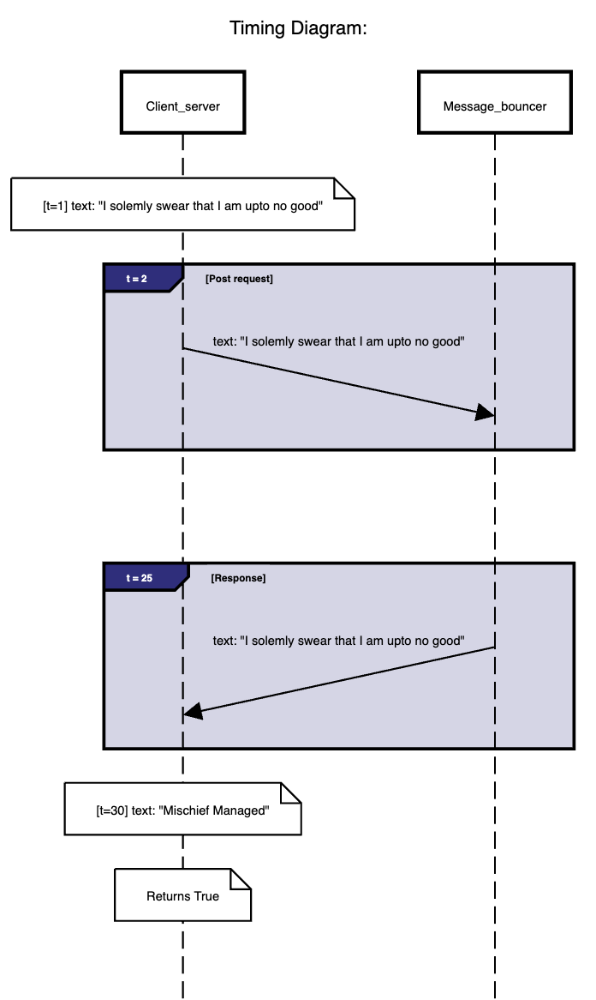
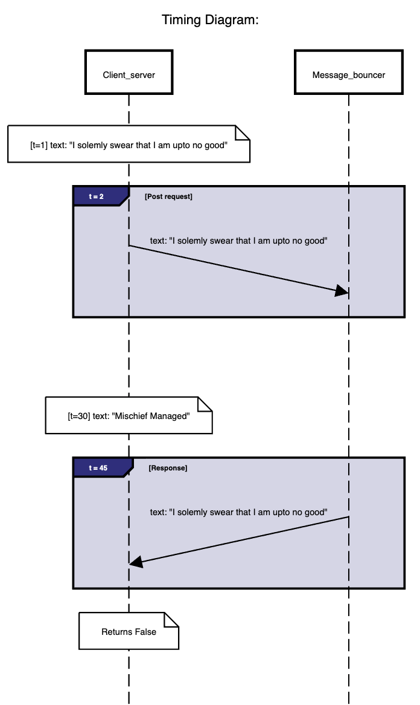

## Client Server Interaction

### Steps to run:

- ### Install Node and libraries:\
    `npm install -y`\
    `npm install xml2js`\
    `npm install fetch-node`\
    or just clone this repo and do: `npm install`
    Please follow the comment instructions in code files to run certain aspects\
    of files (Not needed if you only want to run the jasmine testcase)

-  ### Testcases:
    #### Previous(HW4) Testcases:
    - test 1 - 3: success cases where the server return with the content of the file
    - test 4 - 7: error in format for xml, json, missing content type
    #### Part A
    - test 8: Incorrect URL
    - test 9: Same city (rutgers.edu)
    - test 10: Same continent (google.com)
    - test 11: Different continent (inidanrailways.gov.in)
    #### Part B
    - test 12: localhost with constant delay(1) returns false
    - test 13: localhost with constant delay(20) returns true or false
    - test 14: localhost with constant delay(200) returns true

- ### Conetent

### Here we are trying to understand the interaction between client and server:

    - With the help of the code provided we can find average RTT 
    - After I run the message_bouncer.js it sets up localhost on post:3000
    - When I run server.js, it checks the average time it takes to get response from localhost
    - Then client_server.js sends text response("I solmely swear that I am upto no good") to the message_bouncer - server which then returns the same text but if the server responds after the delay the text that is stored in the client server code is changed ("Mischief Managed"). Which mean that the text returned by the message_bouncer will not be equal to the one at the client server and the code will return false.
    - I have generated a timing diagram to potray the same below:

### When it returns true

### When it returns false
